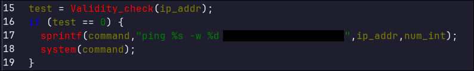
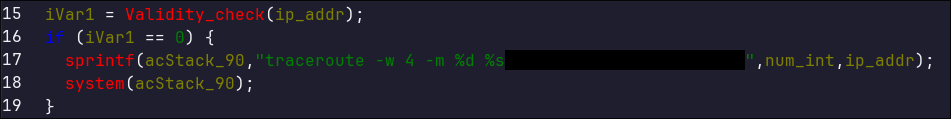
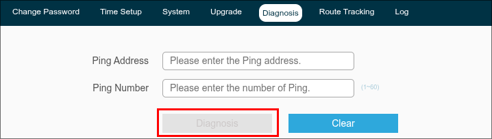
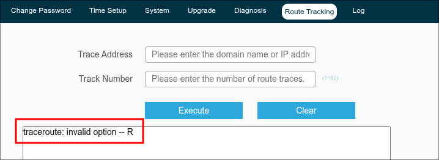

# TOTOLINK-A720R-arg-inj

## Submitter: Nicola Giuffrida

## Information

**Vendor:** TOTOLINK  
**Vendor's website:** [TOTOLINK](https://www.totolink.net/)  
**Model:** A720R  
**Firmware version:** V4.1.5cu.630_B20250509  
**Firmware download address:** [TOTOLINK](https://www.totolink.net/home/menu/detail/menu_listtpl/download/id/203/ids/36.html)

## Vulnerability details

Insufficient sanitization from Validity_check function leads to argument injection in `setDiagnosticCfg` and `setTracerouteCfg` components.

The vulnerable code is found in `FUN_0041f1ac()` and `FUN_0041f0e4()` of the cstecgi.cgi firmware binary; in both functions the `ip_addr` buffer is populated directly from an HTTP request parameter:

Injecting '#' character in the ip address field of the Diagnosis function via crafted HTTP request leads to the "Diagnosis" button becoming unresponsive, making such function indefinitely unavailable:

Injecting arbitrary arguments using '-' character in the ip address field of the Route Tracking function (or Diagnosis function) via crafted HTTP request leads to argument injection:

